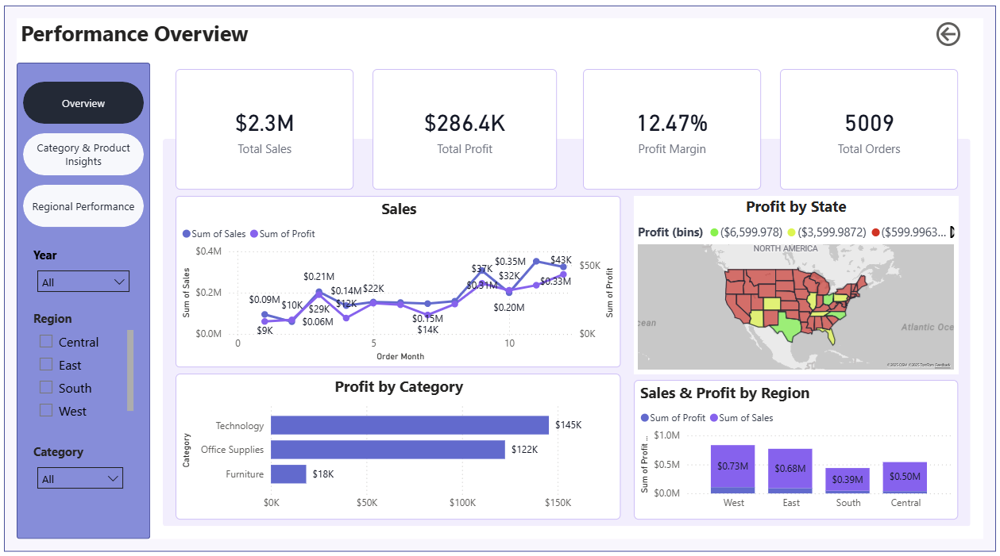
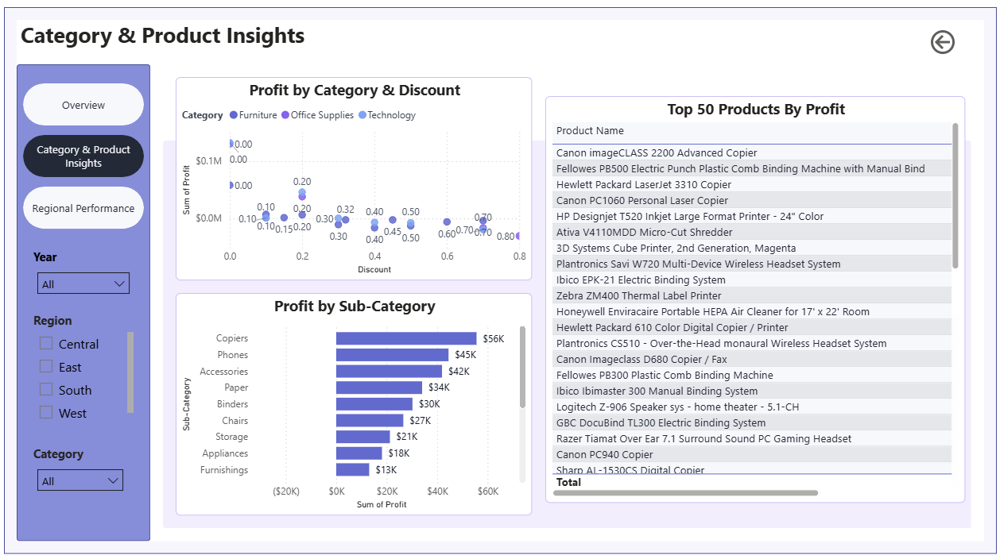
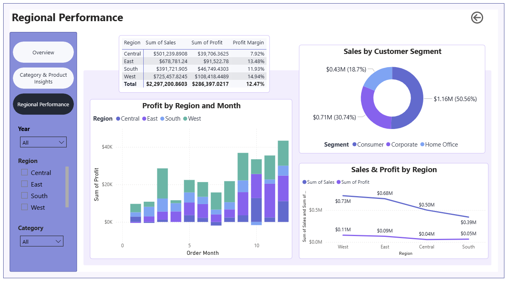

# 🧮 Superstore Sales & Profit Dashboard

## 📊 Project Overview
An interactive **Power BI Dashboard** analyzing Superstore sales and profit performance across regions, categories, and customer segments.
Includes complete **data cleaning** and **exploratory data analysis (EDA)** using Python before visualizing insights in Power BI.

---

## 📂 Data Source
The dataset used in this project was obtained from [Kaggle’s Superstore Sales Dataset](https://www.kaggle.com/datasets/vivek468/superstore-dataset-final). 
It contains transactional sales data including order details, customer segments, regions, and profit metrics from a fictional superstore.

---

## 🧰 Tools & Technologies
- **Python (Pandas, Matplotlib, Seaborn)**- Data cleaning and EDA
- **Power BI** - Dashboard creating and interactive visuals
- **Excel/ CSV**- Source data format
- **GitHub**- Version control and portfolio hosting

---

## 📁 Project Structure

Superstore-Sales-Dashboard/
│
├── data/ → Raw and cleaned dataset(s)
├── notebooks/ → Jupyter notebooks for cleaning and EDA
├── dashboard/ → Power BI report (.pbix)
├── visuals/dashboard_screenshots/
│ ├── overview_page.png
│ ├── category_page.png
│ └── regional_page.png
└── README.md → Project documentation

---

## 🧼 Data Preparation
- Removed missing values 
- Standardized column names and data types
- Feature new temporal features for time based analysis:
    - **Order Year** - extracted from the `Order Date` column to analyze annual trends
    - **Order Month** - extracted from the `Order Date` colum to visualize monthly sales and profit patterns
- Created calculated columns: `Profit Margin = Profit / Sales` and `Profit Bins` for map color gradient  
- Verified data accuracy by cross-checking totals against source reports

---

## 🔍 Exploratory Data Analysis (EDA)
The exploratory phase focused on answering key business questions using descriptive analytics and visual summaries in Python.

**Questions Explored:**
1. **Which region bring in the most sales and profit?**
   - Analyzed sales and profit by region to identify top-performing geographic areas.
   - Found that the **West Region** consistenly outperformed all others in both total sales and profit
  
2. **Which Category or Sub-Category drives the most revenu?**
   - Grouped data by product category and sub-category to identify revenue leaders
   - **Technology** and ** Office Suppies** were top contributors, while **Tables** showed lower profitability

3. **Which customer segment has the highest profit margin?**
   - Compared sales and profit across **Consumer**, **Corporate**, and **Home Office** segments.
   - The **Consumer segment** had the strongest overall porfit margin
  
4. **What are the monthly sales trends?**
   - Extrated `Order Month` and `Order Year` to visualize seasonality
   - Sales showed steady increase in **Q4 of each year**, likely tied to holiday demand and end-of-year purchasing behavior.
  
5. **How do discounts impact sales and profit margins?**
   - Conducted a correlation analysis between `Discount`, `Sales` and `Profit` to identify relationships.
   - Found that higher discounts are negatively correlated with profit, indicating that large discounts reduce profitability more than they drive additional sales.
  
**EDA Techniques Used:** 
- Aggreation and summary statistics using `pandas`
- Correlation analysis between discount, profit, and sales
- Visualizations with `matplotlib` and `seaborn` for trends, distributions, and category comparisons

---

## 🖼️ Dashboard Preview
| Overview | Category Insights | Regional Performance |
|----------| ------------------| ---------------------|
|  |  |  |

---

## 📈 Key Insights
- **West Region** generates that highest sales and profit margins.
- **Technology products** outperform other categories in profit ratio.
- **High discount levels** correlate with lower profitability.
- The dashboard supports data-driven decisions on pricing and inventory.

---

## 👩🏽‍💻 Author
**Jaya Gayle**
M.S. Data Analytics | University of Maryland Global Campus
📍 Based in South Korea (US SOFA Status)  
🔗 [LinkedIn Profile](www.linkedin.com/in/jaya-gayle-908680389)  |  📧 jayagayle154@gmail.com

   
